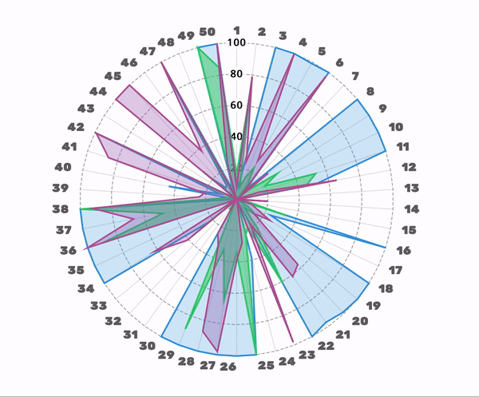

# 50DaysOfCode

On 1st January, 2019, I started 50 Days Of Code challenge. During the course of this challenge, I pledged to code for the next 50 days in Python, Java and C++. The problems were selected from LeetCode and the code was pushed iff all the test cases are successful. I completed this challenge to enhance my skills and keep in touch with few of the most practiced languages. 

## Results 

During the last 50 days I covered 10+ topics from different difficulty levels and achieved 100 percentile time complexity 35 times. I have created few visual statistics to give viewers a better idea.

**Percentil of Time Complexity**

C++ (Blue)

Javan (Green)

Python (Red)

   

*For any suggestions, feel free to mail me on jkrajpop@ncsu.edu*

## Day 1

Given a string, find the length of the longest substring without repeating characters.

**Difficulty:** Medium

**Problem Number:** 3

**Link:** https://leetcode.com/problems/longest-substring-without-repeating-characters/

## Day 2

Given an array nums of n integers and an integer target, find three integers in nums such that the sum is closest to target.

**Difficulty:** Medium

**Problem Number:** 16

**Link:** https://leetcode.com/problems/3sum-closest/

## Day 3

Now, given a list of words, each word can be written as a concatenation of the Morse code of each letter. Return the number of different transformations among all words we have.

**Difficulty:** Easy

**Problem Number:** 804

**Link:** https://leetcode.com/problems/unique-morse-code-words/

## Day 4

In a given integer array nums, there is always exactly one largest element.Find whether the largest element in the array is at least twice as much as every other number in the array. If it is, return the index of the largest element, otherwise return -1.

**Difficulty:** Easy

**Problem Number:** 747

**Link:** https://leetcode.com/problems/largest-number-at-least-twice-of-others/

## Day 5

Given a non-empty integer array, find the minimum number of moves required to make all array elements equal, where a move is incrementing a selected element by 1 or decrementing a selected element by 1. You may assume the array's length is at most 10,000.

**Difficulty:** Medium

**Problem Number:** 462

**Link:** https://leetcode.com/problems/minimum-moves-to-equal-array-elements-ii/

## Day 6

Given a sorted array nums, remove the duplicates in-place such that duplicates appeared at most twice and return the new length. Do not allocate extra space for another array, you must do this by modifying the input array in-place with O(1) extra memory.

**Difficulty:** Medium

**Problem Number:** 80

**Link:** https://leetcode.com/problems/remove-duplicates-from-sorted-array-ii/

## Day 7

Given a string S that only contains "I" (increase) or "D" (decrease), let N = S.length. Return any permutation A of [0, 1, ..., N] such that for all i = 0, ..., N-1, such that, if S[i] == "I", then A[i] < A[i+1] and if S[i] == "D", then A[i] > A[i+1].

**Difficulty:** Easy

**Problem Number:** 942

**Link:** https://leetcode.com/problems/di-string-match/

## Day 8

In a 2 dimensional array grid, each value grid[i][j] represents the height of a building located there. We are allowed to increase the height of any number of buildings, by any amount (the amounts can be different for different buildings). Height 0 is considered to be a building as well. 

At the end, the "skyline" when viewed from all four directions of the grid, i.e. top, bottom, left, and right, must be the same as the skyline of the original grid. A city's skyline is the outer contour of the rectangles formed by all the buildings when viewed from a distance. See the following example. What is the maximum total sum that the height of the buildings can be increased?

**Difficulty:** Medium

**Problem Number:** 807

**Link:** https://leetcode.com/problems/max-increase-to-keep-city-skyline/

## Day 9

You're given strings J representing the types of stones that are jewels, and S representing the stones you have.  Each character in S is a type of stone you have.  You want to know how many of the stones you have are also jewels.

**Difficulty:** Easy

**Problem Number:** 771

**Link:** https://leetcode.com/problems/jewels-and-stones/

## Day 10

Given the root node of a binary search tree, return the sum of values of all nodes with value between L and R (inclusive).

**Difficulty:** Medium

**Problem Number:** 938

**Link:** https://leetcode.com/problems/range-sum-of-bst/

## Day 11

Given two strings representing two complex numbers. You need to return a string representing their multiplication.

**Difficulty:** Medium

**Problem Number:** 537

**Link:** https://leetcode.com/problems/complex-number-multiplication/

## Day 12

In a array A of size 2N, there are N+1 unique elements, and exactly one of these elements is repeated N times. Return the element repeated N times.

**Difficulty:** Easy

**Problem Number:** 961

**Link:** https://leetcode.com/problems/n-repeated-element-in-size-2n-array/

## Day 13

The Fibonacci numbers, commonly denoted F(n) form a sequence, called the Fibonacci sequence. Given N, calculate F(N).

**Difficulty:** Easy

**Problem Number:** 509

**Link:** https://leetcode.com/problems/fibonacci-number/

## Day 14

You are given two non-empty linked lists representing two non-negative integers. The digits are stored in reverse order and each of their nodes contain a single digit. Add the two numbers and return it as a linked list.

**Difficulty:** Medium

**Problem Number:** 2

**Link:** https://leetcode.com/problems/add-two-numbers/

## Day 15

S and T are strings composed of lowercase letters. In S, no letter occurs more than once.S was sorted in some custom order previously. We want to permute the characters of T so that they match the order that S was sorted. More specifically, if x occurs before y in S, then x should occur before y in the returned string.

**Difficulty:** Medium

**Problem Number:** 791

**Link:** https://leetcode.com/problems/custom-sort-string/

## Day 16

Given a linked list, swap every two adjacent nodes and return its head.

**Difficulty:** Medium

**Problem Number:** 24

**Link:** https://leetcode.com/problems/swap-nodes-in-pairs/

## Day 17

Given a sorted array nums, remove the duplicates in-place such that each element appear only once and return the new length. Do not allocate extra space for another array, you must do this by modifying the input array in-place with O(1) extra memory.

**Difficulty:** Easy

**Problem Number:** 26

**Link:** https://leetcode.com/problems/remove-duplicates-from-sorted-array/

## Day 18

Given a linked list, remove the n-th node from the end of list and return its head.

**Difficulty:** Medium

**Problem Number:** 19

**Link:** https://leetcode.com/problems/remove-nth-node-from-end-of-list/

## Day 19

Implement pow(x, n), which calculates x raised to the power n (x^n).

**Difficulty:** Medium

**Problem Number:** 50

**Link:** https://leetcode.com/problems/powx-n/

## Day 20

Determine if a 9x9 Sudoku board is valid. A Sudoku board (partially filled) could be valid but is not necessarily solvable.

**Difficulty:** Medium

**Problem Number:** 36

**Link:** https://leetcode.com/problems/valid-sudoku/

## Day 21

Given a 32-bit signed integer, reverse digits of an integer.

**Difficulty:** Easy

**Problem Number:** 7

**Link:** https://leetcode.com/problems/reverse-integer/

## Day 22

Given an unsorted integer array, find the smallest missing positive integer in O(n) time.

**Difficulty:** Hard

**Problem Number:** 41

**Link:** https://leetcode.com/problems/first-missing-positive/

## Day 23

Given an array of integers, 1 ≤ a[i] ≤ n (n = size of array), some elements appear twice and others appear once. Find all the elements that appear twice in this array.

**Difficulty:** Medium

**Problem Number:** 442

**Link:** https://leetcode.com/problems/find-all-duplicates-in-an-array/

## Day 24

Given an array of integers, return indices of the two numbers such that they add up to a specific target.

**Difficulty:** Easy

**Problem Number:** 1

**Link:** https://leetcode.com/problems/two-sum/

## Day 25

Given a non-empty array of digits representing a non-negative integer, plus one to the integer.

**Difficulty:** Easy

**Problem Number:** 66

**Link:** https://leetcode.com/problems/plus-one/

## Day 26

Given the coordinates of four points in 2D space, return whether the four points could construct a square.

**Difficulty:** Medium

**Problem Number:** 593

**Link:** https://leetcode.com/problems/valid-square/

## Day 27

Given two strings S and T, return if they are equal when both are typed into empty text editors. # means a backspace character.

**Difficulty:** Easy

**Problem Number:** 844

**Link:** https://leetcode.com/problems/backspace-string-compare/

## Day 28

You need to construct a string consists of parenthesis and integers from a binary tree with the preorder traversing way.

**Difficulty:** Easy

**Problem Number:** 606

**Link:** https://leetcode.com/problems/construct-string-from-binary-tree/

## Day 29

Given the root node of a binary search tree (BST) and a value to be inserted into the tree, insert the value into the BST. 

**Difficulty:** Medium

**Problem Number:** 701

**Link:** https://leetcode.com/problems/insert-into-a-binary-search-tree/

## Day 30

Given a string S and a character C, return an array of integers representing the shortest distance from the character C in the string.

**Difficulty:** Easy

**Problem Number:** 821

**Link:** https://leetcode.com/problems/shortest-distance-to-a-character/

## Day 31

We have a string S of lowercase letters, and an integer array shifts. Call the shift of a letter, the next letter in the alphabet, (wrapping around so that 'z' becomes 'a'). Now for each shifts[i] = x, we want to shift the first i+1 letters of S, x times.

**Difficulty:** Medium

**Problem Number:** 848

**Link:** https://leetcode.com/problems/shifting-letters/

## Day 32

Design a data structure that supports the following two operations:
  1) void addNum(int num) - Add a integer number from the data stream to the data structure.
  2) double findMedian() - Return the median of all elements so far.

**Difficulty:** Hard

**Problem Number:** 295

**Link:** https://leetcode.com/problems/find-median-from-data-stream/

## Day 33

Write an efficient algorithm that searches for a value in an m x n matrix. This matrix has the following properties:
  1) Integers in each row are sorted in ascending from left to right.
  2) Integers in each column are sorted in ascending from top to bottom.

**Difficulty:** Medium

**Problem Number:** 240

**Link:** https://leetcode.com/problems/search-a-2d-matrix-ii/

## Day 34

Suppose an array sorted in ascending order is rotated at some pivot unknown to you beforehand. You are given a target value to search. If found in the array return its index, otherwise return -1, in O(log n).

**Difficulty:** Medium

**Problem Number:** 33

**Link:** https://leetcode.com/problems/search-in-rotated-sorted-array/description/

## Day 35

Suppose an array sorted in ascending order is rotated at some pivot unknown to you beforehand.You are given a target value to search. If found in the array return true, otherwise return false, in O(log n).

**Difficulty:** Medium

**Problem Number:** 81

**Link:** https://leetcode.com/problems/search-in-rotated-sorted-array-ii/

## Day 36

Given a non-negative index k, return the kth index row of the Pascal's triangle.

**Difficulty:** Easy

**Problem Number:** 119

**Link:** https://leetcode.com/problems/pascals-triangle-ii/

## Day 37

Given a non-negative integer numRows, generate the first numRows of Pascal's triangle.

**Difficulty:** Easy

**Problem Number:** 118

**Link:** https://leetcode.com/problems/pascals-triangle/

## Day 38

Given an integer, write a function to determine if it is a power of two.

**Difficulty:** Easy

**Problem Number:** 231

**Link:** https://leetcode.com/problems/power-of-two/

## Day 39

Given a singly linked list L: L0→L1→…→Ln-1→Ln,reorder it to: L0→Ln→L1→Ln-1→L2→Ln-2→…

**Difficulty:** Medium

**Problem Number:** 143

**Link:** https://leetcode.com/problems/reorder-list/

## Day 40

Given an input string, reverse the string word by word (Input string may contain leading or trailing spaces. However, your reversed string should not contain leading or trailing spaces).

**Difficulty:** Medium

**Problem Number:** 151

**Link:** https://leetcode.com/problems/reverse-words-in-a-string/

## Day 41

Given a singly linked list, group all odd nodes together followed by the even nodes. Please note here we are talking about the node number and not the value in the nodes.

**Difficulty:** Medium

**Problem Number:** 328

**Link:** https://leetcode.com/problems/odd-even-linked-list/

## Day 42

Given a binary array, find the maximum number of consecutive 1s in this array.

**Difficulty:** Easy

**Problem Number:** 485

**Link:** https://leetcode.com/problems/max-consecutive-ones/

## Day 43

Given an array A of integers, return the length of the longest mountain. 

**Difficulty:** Medium

**Problem Number:** 845

**Link:** https://leetcode.com/problems/longest-mountain-in-array/

## Day 44

Given an array A of integers, for each integer A[i] we may choose any x with -K <= x <= K, and add x to A[i]. After this process, we have some array B.vReturn the smallest possible difference between the maximum value of B and the minimum value of B.

**Difficulty:** Easy

**Problem Number:** 908

**Link:** https://leetcode.com/problems/smallest-range-i/

## Day 45

Given a List of words, return the words that can be typed using letters of alphabet on only one row's of American keyboard like the image below.

**Difficulty:** Easy

**Problem Number:** 500

**Link:** https://leetcode.com/problems/keyboard-row/

## Day 46

Given a non negative integer number num. For every numbers i in the range 0 ≤ i ≤ num calculate the number of 1's in their binary representation and return them as an array.

**Difficulty:** Medium

**Problem Number:** 338

**Link:** https://leetcode.com/problems/counting-bits/

## Day 47

Write a program that outputs the string representation of numbers from 1 to n. But for multiples of three it should output “Fizz” instead of the number and for the multiples of five output “Buzz”. For numbers which are multiples of both three and five output “FizzBuzz”.

**Difficulty:** Easy

**Problem Number:** 412

**Link:** https://leetcode.com/problems/fizz-buzz/

## Day 48

Given n non-negative integers representing an elevation map where the width of each bar is 1, compute how much water it is able to trap after raining.

**Difficulty:** Hard

**Problem Number:** 42

**Link:** https://leetcode.com/problems/trapping-rain-water/

## Day 49

Implement a trie with insert, search, and startsWith methods.

**Difficulty:** Medium

**Problem Number:** 208

**Link:** https://leetcode.com/problems/implement-trie-prefix-tree/

## Day 50

Given a non-empty, singly linked list with head node head, return a middle node of linked list. If there are two middle nodes, return the second middle node.

**Difficulty:** Easy

**Problem Number:** 876

**Link:** https://leetcode.com/problems/middle-of-the-linked-list/

